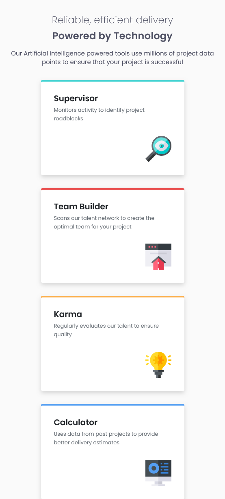

### Screenshot

# Frontend Mentor - Four card feature section solution

This is a solution to the [Four card feature section challenge on Frontend Mentor](https://www.frontendmentor.io/challenges/four-card-feature-section-weK1eFYK). Frontend Mentor challenges help you improve your coding skills by building realistic projects. 

## Table of contents

- [Overview](#overview)
  - [The challenge](#the-challenge)
  - [Screenshot](#screenshot)
  - [Links](#links)
- [My process](#my-process)
  - [Built with](#built-with)
  - [What I learned](#what-i-learned)
  - [Continued development](#continued-development)
  - [Useful resources](#useful-resources)
- [Author](#author)
- [Acknowledgments](#acknowledgments)

**Note: Delete this note and update the table of contents based on what sections you keep.**

## Overview

### The challenge

Use grid to position cards differently based on screen size.

### Links

- Solution URL: [https://github.com/djmills89/FourCard]Github
- Live Site URL: [https://dm-four-card.netlify.app/]Live Site

## My process

### Built with

- Semantic HTML5 markup
- CSS custom properties
- Flexbox
- CSS Grid
- Mobile-first workflow
- Small bit of Bootstrap 🤏

### What I learned

Grid template areas are good for grid layouts that change and for layouts that are harded to mainpulate other grid tools.

## Author
- Frontend Mentor - [https://www.frontendmentor.io/profile/djmills89]Daniel Mills